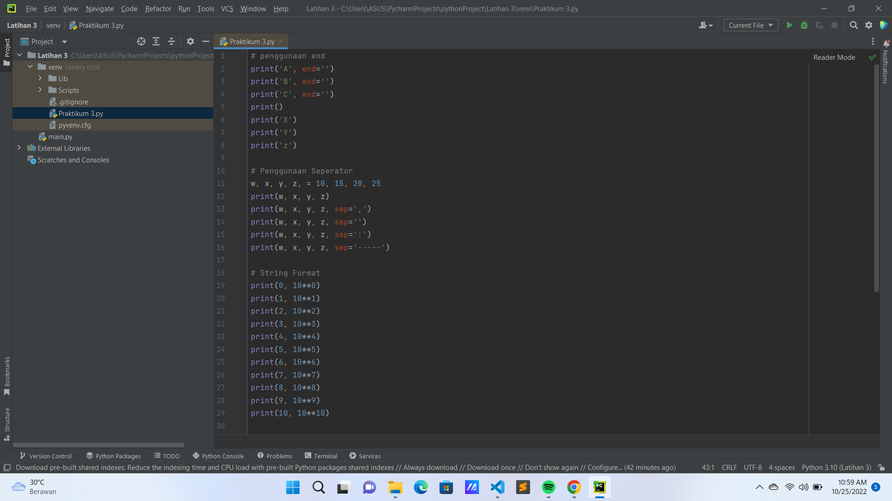
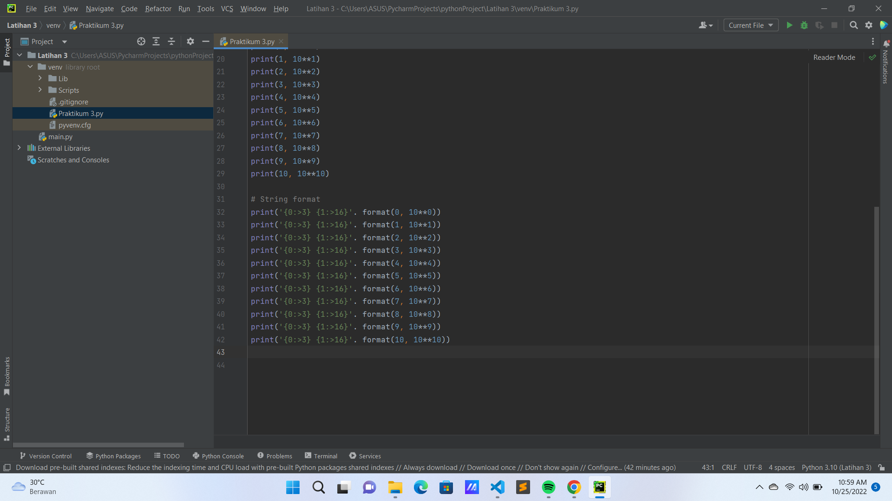
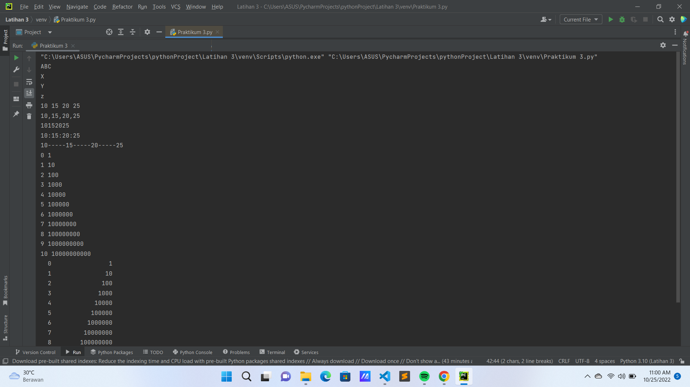
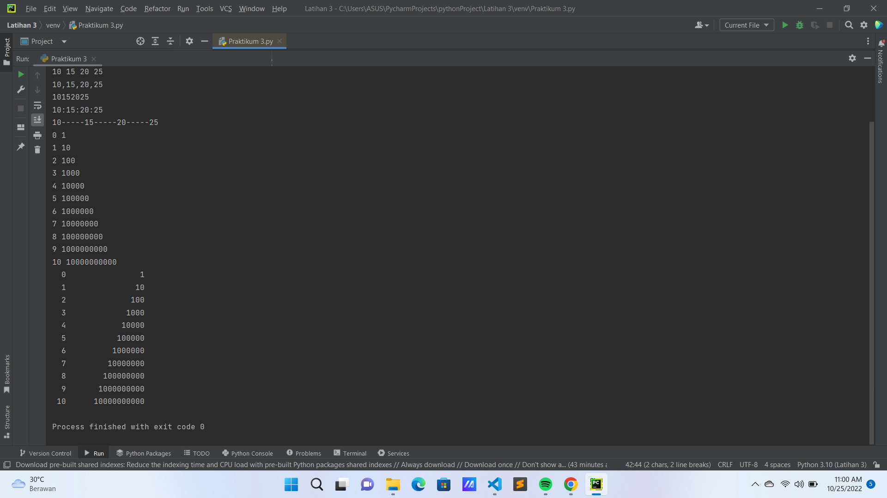
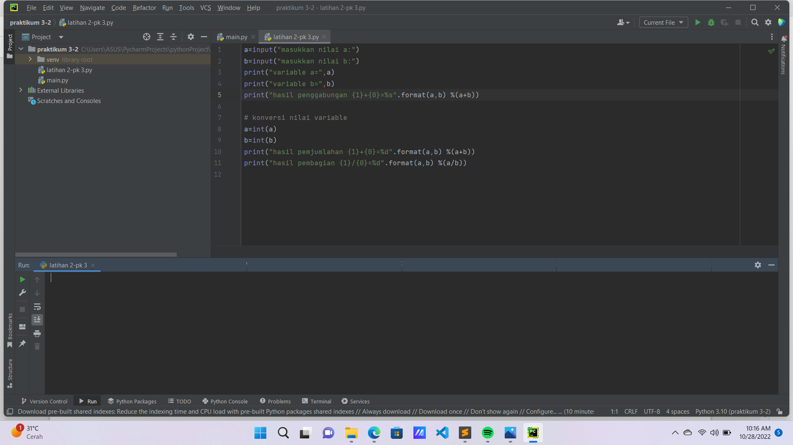
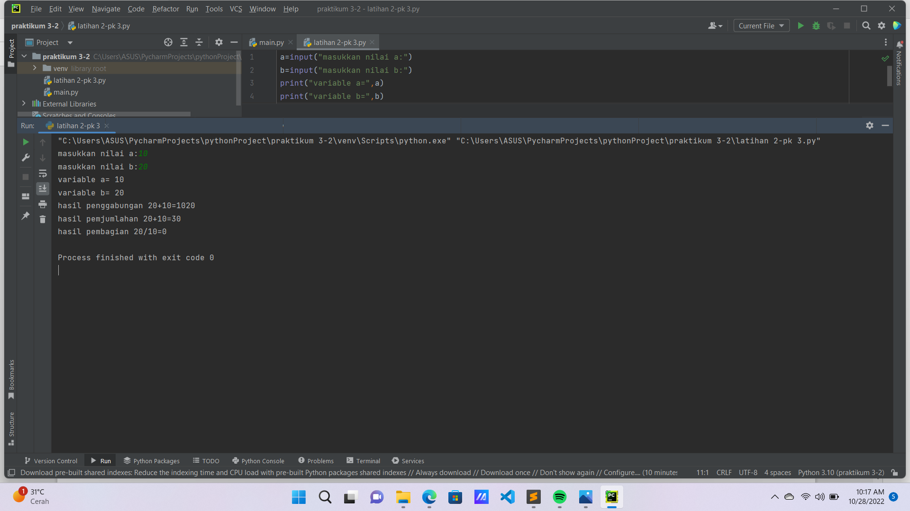
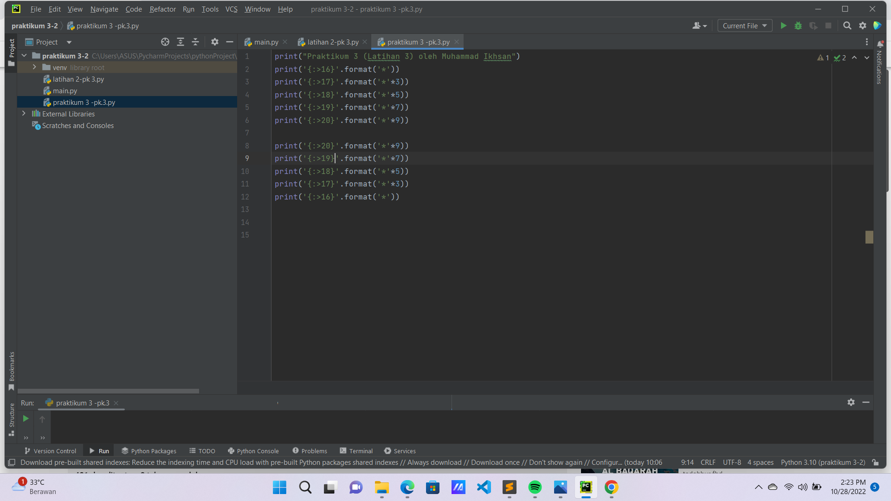
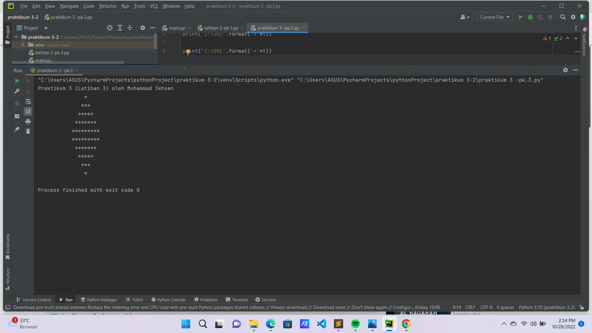

# Praktikum3
Latihan Praktikum 3

**Latihan 1**

Pada latihan yang pertama , saya akan membuat beberapa contoh di antara nya :
- Penggunaan end
- Penggunaan seperator
- Penggunaan string format (1)
- Penggunaan string format (2)

berikut adalah kode program dan gambar *screenshot* nya :

Lalu klik tombol **RUN**

Maka hasilnya akan seperti ini :

**Latihan 2**

Pada latihan kedua , saya akan membuat sebuah contoh input variable.

Silahkan ketik kode program seperti berikut :

lalu klik tombol **RUN**

Ketika sudah muncul kalimat (Masukkan nilai) , maka isi dengan :
- A = 10
- B = 20

lalu tekan **ENTER**.

Maka hasilnya akan seperti ini :

**Latihan 3**

Pada latihan terakhir , saya akan membuat gambar (belah ketupat) dengan kode program *string formating*.

Silahkan ketik kode program seperti berikut :

lalu klik tombol **RUN**.

Maka hasilnya akan seperti ini :

Sekian laporan Praktikum yang ke-tiga dari saya , alangkah baik nya temen-temen semua bisa mengikuti semua tutorial yang sudah di jelaskan.

Sampai ketemu lagi di tutorial selanjutnya.